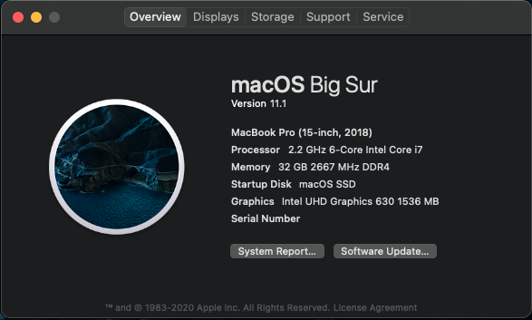
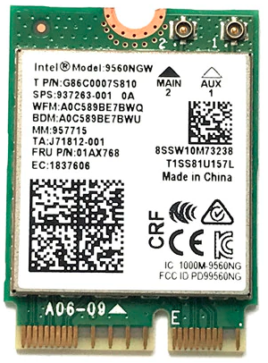
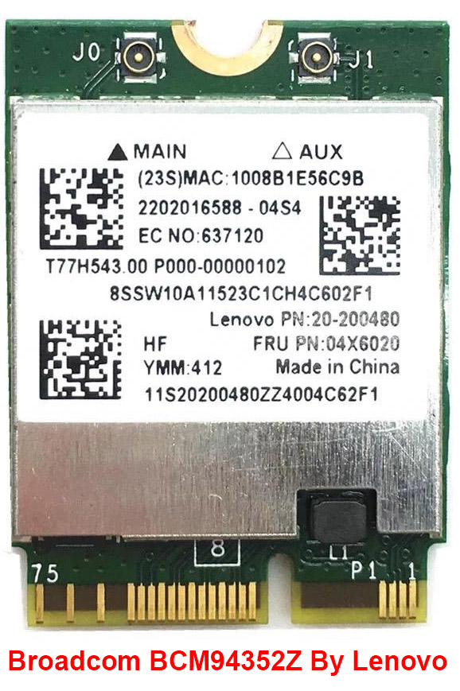

# Legion Y730 running macOS Big Sur 11.1
<p align="justify" >
If you are a windows user and require macOS to learn XCode, then you can transform your windows machine into the Hackintosh machine. Remember, this tutorial is for educational purpose. I will be not responsible for any damage done to your device while installing macOS. Do at your own risk. This tutorial is only for Lenovo legion Y730/Y740. Back up your important files before starting. All files, that you require for macOS installation, are available in my GitHub page. This guide is in <b>chronological order</b>. So, do not miss any steps. Now let's begin.
</p>
<p align="center"></p>


## Make Bootable USB with macOS Big Sur, on a Windows 10 machine:
```
  ✰✰✰✰✰✰✰✰✰✰✰✰✰✰✰ You can make a bootable USB from an original Mac machine, or ✰✰✰✰✰✰✰✰✰✰✰✰✰✰✰✰
  ✰✰✰✰✰✰✰✰✰ from a macOS installed into VirtualBox (especially the Windows OS users) ✰✰✰✰✰✰✰✰✰✰
  ```
</img>
<p align="justify" > 
  Here I will explain the process of making a bootable USB drive. So be patience:
  <br>&nbsp;① Size of the USB drive can be 16GB or more.
  <br>&nbsp;② Install any macOS operating system(Sierra or later) into a <a href="https://www.youtube.com/watch?v=qdR3T2jKucE" target="_blank">VirtualBox</a>.
  <br>&nbsp;③ You can download the macOS_Catalina.dmg file from <a href="https://www.torrentmac.net/macos-catalina-10-15-6-19g73/" target="_blank">torrentmac.net</a>, then open it &emsp;&emsp;through VirtualBox and copy "macOS Catalina Installer" into the "Applications" &emsp;&emsp;&nbsp;&nbsp;&nbsp;&nbsp;&nbsp;&nbsp;&nbsp;&nbsp;section of macOS.
  <br>&nbsp;④ Use USB 2.0 pen drive, to avoid error like: 🚫  sign with <a href="https://github.com/md-siam/Hackintosh-Legion-Y730_Y740/blob/master/images/USB_Disconnected.jpg" target="_blank">dark background</a>.
  <br>&nbsp;⑤ Open "Disk Utility" and format your USB pendrive according to this <a href="https://github.com/md-siam/Legion_Y730_running_Catalina/blob/master/images/USB_Formatting.png" target="_blank">configuration</a>.
  <br>&nbsp;⑥ Start "Terminal" from Launchpad>Other, and copy & paste the command below:

<pre><span class="note">sudo /Applications/Install\ macOS\ Big\ Sur.app/Contents/Resources/createinstallmedia --volume /Volumes/MyVolume</var>
</span></pre>
<p align="justify" > 
  <br>&nbsp;⑦ <i>"MyVolume"</i> - it is the name of your USB pen drive.
  <br>&nbsp;⑧ After making a USB bootable device, download "Clover Configurator" inside the VirtualBox. Mount the EFI &emsp;&emsp;&emsp;&nbsp;&nbsp;&nbsp;&nbsp;&nbsp;partition, of the USB drive, using clover configurator, and replace the EFI folder with my EFI folder (unzip EFI.7z &emsp;&nbsp;&nbsp;&nbsp;before placing it inside EFI partition).
  <br>&nbsp;⑨ Done with bootable USB device.
</p>

## BIOS Settings:
```
  ✰✰✰✰✰✰✰✰✰ First of all, upgrade your Lenovo Legion Y730 BIOS to "8XCN34WW (V2.03)" ✰✰✰✰✰✰✰✰✰✰
  ✰✰✰✰✰✰✰✰✰✰✰✰✰✰✰✰✰ Because this EFI file is only tested in that BIOS version ✰✰✰✰✰✰✰✰✰✰✰✰✰✰✰✰✰
  ✰✰✰✰✰✰✰✰✰✰✰✰✰✰ WARNING! BIOS version downgrading is NOT possible in any laptop ✰✰✰✰✰✰✰✰✰✰✰✰✰✰
  ✰✰✰✰✰✰✰✰✰✰✰✰✰✰✰✰ So, if you upgrad to a newer version then you CANNOT downgrade ✰✰✰✰✰✰✰✰✰✰✰✰✰
  ```
  
- Press F2 to get into the BIOS. Match your BIOS setting with the pictures given below:
  - Information: [Photo](https://github.com/md-siam/Hackintosh-Legion-Y730_Y740/blob/master/images/BIOS_0.jpg)
  - Configuration: [Photo](https://github.com/md-siam/Hackintosh-Legion-Y730_Y740/blob/master/images/BIOS_1.jpg)
  - Security: [Photo](https://github.com/md-siam/Hackintosh-Legion-Y730_Y740/blob/master/images/BIOS_2.jpg)
  - Boot: [Photo](https://github.com/md-siam/Hackintosh-Legion-Y730_Y740/blob/master/images/BIOS_3.jpg)
  - Exit: Save the changes and exit from BIOS [Photo](https://github.com/md-siam/Hackintosh-Legion-Y730_Y740/blob/master/images/BIOS_4.jpg)

## After macOS Installation: 
  - Choose the partition where you install your macOS Catalina, suppose "macOS SSD".
  - Setup your keyboard.
  - Copy "Clover Configarator" app to your "Applications" section.
  - Mount the EFI partition of both USB and "macOS SSD".
  - Copy the EFI folder from USB to EFI partition of "macOS SSD".
  - Now enjoy your hackingtosh.

## Using Intel® Wireless-AC 9560 Wi-Fi card:

<p align="justify" >
So far everything is working smoothly, including the <b>Intel Wi-Fi card</b> inside the laptop. With my laptop, there is Intel® Wireless-AC 9560 dual-band Wi-Fi card, and there is no macOS driver for this Intel card. But there is an ongoing project by <b>Open Intel Wireless Factory</b> by which you can use the following Intel Wi-Fi cards: 
  <br>&emsp;&emsp;&emsp;&emsp;&emsp;&emsp;&emsp;ⓐ 3xxx: 3160, 3165, 3168 
  <br>&emsp;&emsp;&emsp;&emsp;&emsp;&emsp;&emsp;ⓑ 7xxx: 7260, 7265 
  <br>&emsp;&emsp;&emsp;&emsp;&emsp;&emsp;&emsp;ⓒ 9xxx：9260, 9461, 9462, 9560 
  <br>&emsp;&emsp;&emsp;&emsp;&emsp;&emsp;&emsp;ⓓ 22000：ax200
<br><br>Since the <i><a href="https://github.com/1hbb/OpenIntelWireless-Factory" target="_blank">Open Intel Wireless Factory</a></i> project is under development, the internet speed in 2.4GHz & in 5.0GHz signal is little bit slow. On the other hand, <b>Bluetooth</b> inside the Intel 9560 card works perfectly fine. To enable Intel 9560 Wi-Fi feature watch the video tutorial from: <a href="https://www.youtube.com/watch?v=j6Fa5r1Ufi0" target="_blank">here</a> and download the latest <b>itlwm.kext</b> & <b>HeliPort</b> app release from: <a href="https://github.com/1hbb/OpenIntelWireless-Factory" target="_blank">here</a>.
</p>


## Alternative of Intel Wi-Fi card:

<p align="justify" >
If you want to use the native features of macOS Catalina, like <b>AirDrop</b>, and do not want to wait for the final kext release from <b>Open Intel Wireless Factory</b>, then the <b>Broadcom BCM94352Z</b> Wi-Fi card is the alternative of the Intel® Wireless-AC 9560 Wi-Fi card. But it is expensive if you want to buy it in brand new condition. This card is only manufactured by <b>Lenovo</b>.
</p>
<p align="justify" >
Check for Lenovo branding, on the card, before you buy any Wi-Fi card. There are DW cards from DELL, which will not work on Legion Y730, & can damage your macOS installation files. So, only Lenovo branding <b>Broadcom BCM94352Z</b> Wi-Fi card will work in Legion Y730. The Wi-Fi card on your left will work with Apple macOS.
</p>
<p align="justify" >
After installing the Broadcom BCM94352Z Wi-Fi card you will need some additional <b>kext</b> files from a different source. I do not have those kext files into the EFI folder. Follow the guide given here to enable your <b>Broadcom Wi-Fi card</b>. Guide: <a href="https://www.tonymacx86.com/threads/broadcom-wifi-bluetooth-guide.242423/" target="_blank">Broadcom WiFi/Bluetooth</a>.
</p>

## Intel® Virtualization Technology (Intel® VT)
Many applications use Intel Virtualization Technology to work properly, examples like:
- Android Emulator
- iPhone Simulator
- XAMPP
- Virtual Machine
- VMWare
- etc..

So, after successful macOS installation, enabled "Intel Virtual Technology" from BIOS, and those apps will work properly.


## Special Thanks To:
 - [tonymacx86](https://www.tonymacx86.com) for Clover
 - [gibMacOS](https://github.com/corpnewt/gibMacOS) for full macOS Catalina DMG file [sharing](https://github.com/corpnewt/gibMacOS)
 - [@berkeringat__](https://twitter.com/berkeringat__) for providing his [EFI](https://www.dropbox.com/s/hfy1jwdja3wbj76/EFI_LEGION_Y740_10.14.6_V3.zip?dl=0) folder for Mojave
 - [ComputerTipsLaiju](https://www.youtube.com/watch?v=57aA8e9YQSg&t=66s) for macOS installation guide
 - [Jay Wardana](https://www.youtube.com/watch?v=j6Fa5r1Ufi0) for making video on Intel Wi-Fi fix
 - [1hbb](https://github.com/1hbb/OpenIntelWireless-Factory) for providing the HeliPort app & itlwm.kext for Intel 9560 Wi-Fi
